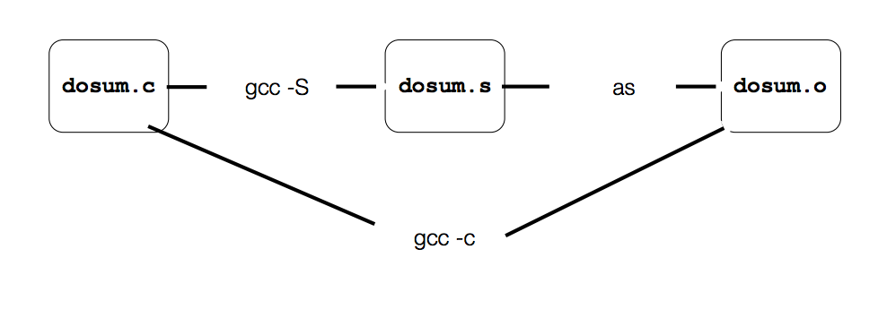

### CSE 333 Lecture 1
#### 3/27/17

* Goals:
    * Syllabus
    * C refresher
* Course details:
    * Things affecting grades
        * Lectures (28) + section (10)
        * Programming projects: 4 (plus HW0, a warmup)
            * Topics: C, C++, file system, network
        * Programming exercises:
            * 1 per lecture, due morning before next lecture
            * Graded 0 - 3
        * Midterm + Final 
    * Programming Assn: 4 late days, 2 max per project 
* Systems Programming: 
    * Programming skills
        * 	C, C++ 
    * engineering discipline
        * testing + debugging + performance analysis
        * code style conventions
        * testing: unit, code coverage, regression 
        * documentation: code comments + design docs
    * knowledge necessary to build a system
        * concurrency
        *  OS interfaces + semantics 
        *  techniques for consistent data management
        *  distributed systems algos
* C:
    * Created 1972 by Dennis Ritchie 
    * Portable across machine architectures
    * Most recently: C99 (1999), C11 (2011)
    * Characteristics:
        * Low-level, smaller std. lib. than Java
        * Procedural (not OOP), so you write functions
        * typed but unsafe (wrong stuff is really wrong)
    * File Types
        * source (.c, .h)
        * object (.o)
        * statically linked libraries (.a) 
        * shared libraries (.s) 
* Workflow of a C program:
    * Essentially, you edit the source files and then compile them into the object files.
    * Then you link the object files together with outside libraries called statically 
      linked libraries. This outputs an executable.
    * Finally you 'load' the executable along with shared libraries, and this generates
      a process (now we are at runtime). 
    
* Translating C to Machine Code
    * Below we illustrate the process of translating a C source file into machine code.
    * We start by compiling the .c file into an assembly source file (with a .s extension). 
        * Note: This .s file might not actually be output by the compiler (it's intermediate state 
     that doesn't need to be retained in most cases), but it is left in here for 
     completeness. This is shown below:
    
    * The assembler then takes said .s file and turns it into executable machine code with
     a .o extension. The diagram below illustrates the entire process:
    
* Multi-file C programs
    * Compiling multi-file programs
        * Multiple objects are linked to produce an executable
        * Std libs (libc, crt1, ...) are usually linked in
        * Lib is just a pre-assembled collection of .o files
    * In the diagram below, we have a 'prototype' in the source file 
        that tells us about the arguments of a function whose body 
        is in a separate source file.
    
    * We also have header files, a kind of source file which contains function declarations
    and macro definitions. 
    * Object files
        * each contains machine code produced by the computer
        * each might contain references to external symbols
            * variables and functions not defined in the associated .c file
            * ex: sumnum.o contains code that relies on printf() and dosum(), 
              but these are defined in libc.a and dosum.o, respectively
            * see the chart above ^^ 
        * linked resolves external symbols while putting together object 
          files and libraries
* C vs. Java Comparision
    * Things that are the same (or very similar)
        * syntax for statements, control structures, and function calls
        * types: `int`, `double`, `char`, `long`, `float`
            * integer types: `char`, `int`
            * floating point types: `float`, `double`
            * modifiers:
                * `short [int]`
                * `long [int, double]`
                * `signed [char, int]`
                * `unsigned [char, int]`
            * NOTE: The sizes below aren't actually standardized, they are just typical
            
            * C99 extended integer solves this issue as seen below:
                ```C 
                #include <stdint.h>

                void foo(void) {
                  int8_t  w;    // exactly 8 bits, signed
                  int16_t x;    // exactly 16 bits, signed
                  int32_t y;    // exactly 32 bits, signed
                  int64_t z;    // exactly 64 bits, signed

                  uint8_t w;    // exactly 8 bits, unsigned
                  ...etc.
                }
                ``` 
        * variables: similar to Java, don't have to declare at start of a 
            function or a block
            * need not be initialized before use
            * The following example illustrates these points:
            ```C	
                include <stdio.h>

                int main(int argc, char **argv) {
                  int x, y = 5;   // note x is uninitialized!
                  long z = x+y;

                  printf("z is '%ld'\n", z); // what's printed?
                  {
                    int y = 10;
                    printf("y is '%d'\n", y);
                  }
                  int w = 20;  // ok in c99
                  printf("y is '%d', w is '%d'\n", y, w);
                  return 0;
                }
            ```
		    * `const`: a qualifier that indicates the variable's value cannot change	
                * compiler will issue an error if you try to violate this
            * `for` loops:
                * can declare variables in the loop header
            * `if/else`, `while`, and `do/while` loops
                * bool type is supported, with `#include <stdbool.h>`
                * any type can be used: 0 == false, everything else true
        * parameteres and return values
            * C always passes arguments by value
            * Can also pass 'pointers'; these let you pass by reference
                * the least intuitive, most dangerous part of C
        * type casting syntax: `float x = (float) 5 / 3;`
        * expressions, operators (`*`, `+`, `-`, etc.), precedence
        * scoping rules (ex: local scope is within `{}` braces
        * comments: /* */ and // 
    * Things that are different (very different)
        * Arrays
            * just bare, contiguous blocks of memory o/t correct size
            ex: array of 10 ints -> 10 * 4 bytes = 40 bytes of memory
            * have no methods, don't know own length
        * Strings
            * arrays of characters (`char`)
            * terminated by the NULL character '\0'
            * aren't objects, have no methods (string.h has helpful utilities)
            * ex: `x = h|e|l|l|o|\n|\0`, `char *x = "hello\n";`
        * Errors + exceptions: none in C (no try catch)
            * errors returned as integer error codes from functions
        * Crashes: basically you just get a segfault and a kind letter
            telling you to gently go fuck yourself
        * objects: they don't exist (structs are the closest)
        * Memmory management: no garbage collector!
            * local vars allocated off the stack, freed when you return from function
            * globals ands static vars allocated in data segment, 
                freed when your program exits
            * can allocate memory in the heap segment using malloc()
                * must free malloc'd memory with free()
                * failing to free is a leak, double freeing is an error
        * Library support: very few C libraries, no built in data structures


