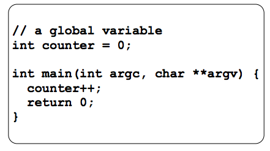
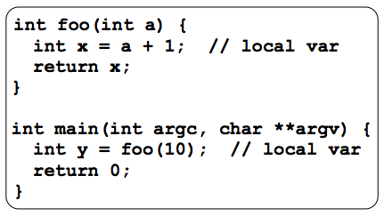
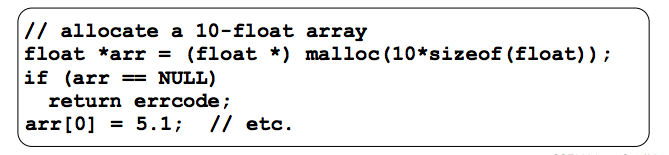
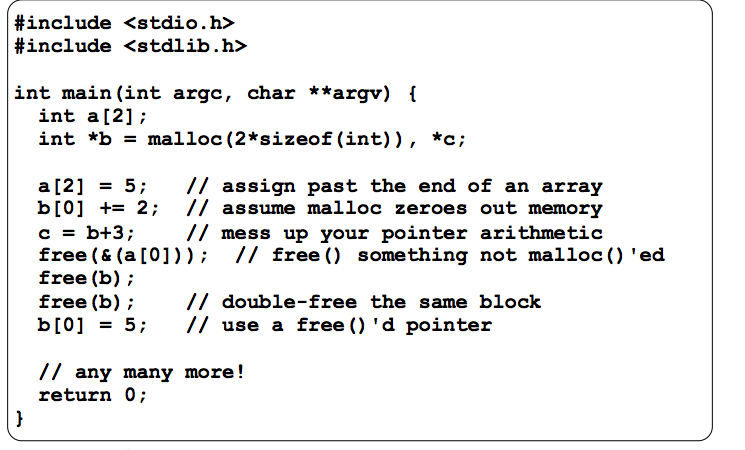
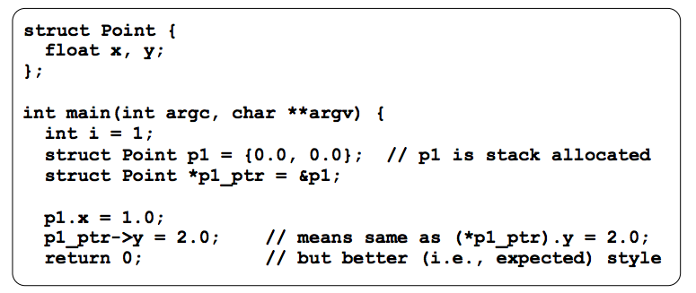

### Week 2: Data Structures and C Wrap Up
* Malloc, free, structs and typedef: Lecture 4
    * 2 Kinds of memory allocation SO FAR
        * Static allocation
            * Allocated when program loads
            * Deallocated when program exits
            * 
        * Automatic Allocation
            * Allocated when function is called
            * Deallocated when function returns
            * 
    * We need more flexibility! Want to allocate memory such that:
        * Persists across multiple function calls but for less than 
        the lifetime of the program
        * Is too big to fit on the stack
        * Is allocated and returned by a function and its size is 
        not known to the caller in advance
    * New memory allocation type: Dynamic Allocation
        * program explicity requests a new block of memory
            * language runtime does the allocation, w/help from the OS
        * dynamically allocated memory persists until:
            * Your code explicitly deallocates it
            * THIS IS THE ONLY OPTION IN C!!!
    * Dynamic allocation in C:
        * `variable = (type *) malloc(size in bytes);`
        * malloc allocates a block of memory of the given size
            * returns a pointer to the first byte of that memory
            * returns NULL if the memory couldn't be allocated
            * You should assume the memory initially contains garbage
            * You'll typically use `sizeof` to calculate the size you need
            * ex: 
        * `calloc(howmany, # bytes for each)` is a cousin of `malloc`
            * zeroes out the block of memory
            * a little bit slower than malloc
        * `malloc` and `calloc` found in `stdlib.h`
    * Deallocation
        * `free(ptr)` releases the memory pointed to by the pointer
        * Pointer must point to the first byte of heap-allocated memory
        * Aftering freeing a block of memory, that block might be used in 
        future malloc/calloc
        * Setting pointer to NULL afterwards is good practice
    * NULL
        * a guarenteed to be invalid memory location
        * Attempts to dereference NULL are met with segmentation fault
    * Memory corruption:
        * 
    * Memory leaks
        * Happens when code fails to deallocate dynamically allocated memory that will no longer be used
        * Your program's virtual memory footprint will keep growing
            * okay in the short-term, bad in the long-term
        * Might slow down process overtime (VM Thrashing, hurts cache usage)
    * Structured Data
        * ```C
            struct tagname {
                type name;
                ...
                type name;
            };
         ```
        * Struct is a C type that contains a set of fields
        * Similar to Java class, but without methods/constructors
        * instances can be allocated on stack or heap
        * Useful for defining new structured types of data
    * Structs in practice
        * `.` refers to the fields in a struct
        * `->` refers to the fields through a pointer 
        * Example: 
        * Assigning the value of a struct to a struct of the 
        ssame type copies the entire contents of the struct
    * `typedef`
        * `typedef type name` allows you to define a new type whose name is `name`
        * Especially useful when dealing with structs:
        * ```C
            typedef struct point_st {
                long x;
                long y;
            } Point;

            Point origin = {0, 0};
          ```
    * You can malloc and free structs as with other types
    * Structs as args
        * structs are passed by value (like everything else in C except arrays)
        * The entire structure is copied
        * Use a pointer to pass by reference
    * Should you pass a pointer or a value?
        * Pointer copy is cheaper and takes less space unless struct is small
        * Indirect field references through pointers are a bit more expensive, 
        also can be harder for compiler to optimize because of ptr aliasing
        * For small things, use call by value, for larger things, pass pointers
* Data Structures and Modules: Lecture 5
    * Review of linked lists
        * each node has some payload, next pointer
        * last node's pointer points to NULL 
    * Generic Linked List
        * let the data field be a `void *` pointer, can point to arbitrary
        elements
        * Clients of the data structure must use type casting
            * Convert their data type to a `void *` before pushing
            * Convert back to typed pointer when accessing
    * Multi-file C programs
        * Module: a self contained piece of an overall program
            * has externally visible functions that clients can invoke
            * has externally visible typedefs, and sometimes global vars
            that clients can use
            * May have internal funcs, typedefs, global vars that clients
            shouldn't look at
            * has an **interface**: set of public functions, typedefs and global functions
        * C header files
            * header: a C file whose only purpose is to be `#include`'d
                * generally a filename with `.h`
                * holds variables/types/function prototype declarations that make up 
                the interface of a module
            * Main idea: 
                * every name.c intended to be a module has a name.h
                * name.h declares the interface to that module
                * other modules wanting to use name will `#include <name.h>`
        * Module conventions
            * .h files only contain declarations, never definitions
            * .c fiels never contain prototype declarations for functions 
            that are intended to be exported throught the module interface
                * those function prototype declarations belong in the .h file
            * never `#include` a .c file, only .h files
            * `#include` all of the headers you reference, even if another header
            header includes some of them
            * any .c file with an associated .h file should be able to be compiled 
            into a .o file
                * the .c file should include the .h file
                * The compiler will check definitions and declarations
        * `#include` and the C preprocessor
            * The C preprocessor (cpp) transforms your source code BEFORE the compiler runs
            * It transforms your original C source code into transformed C source code
            * processes the directive it finds in your code
            * run on your behalf by gcc during compilation
        * Where do the comments go? 
            * If a function is declared in a header file and defined in a C file
                * the header needs full documentation 
            * If a function has a prototype and the implementation in the same C file
                * Option 1: full comment on the prototype at the top of the file, no comment
                on the code
                * Option 2: comments belong with the code, prototype is for the compiler
